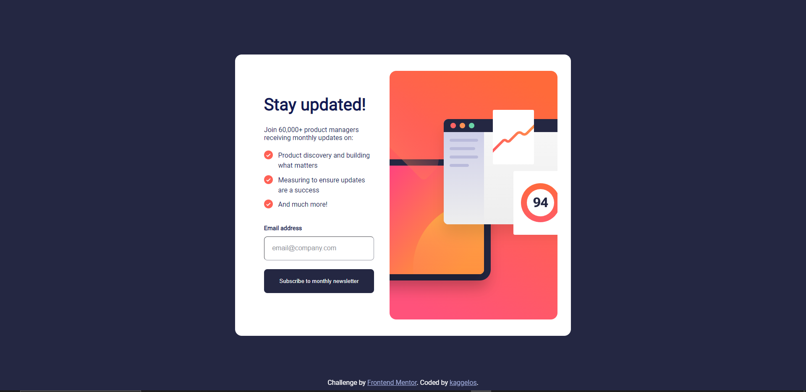
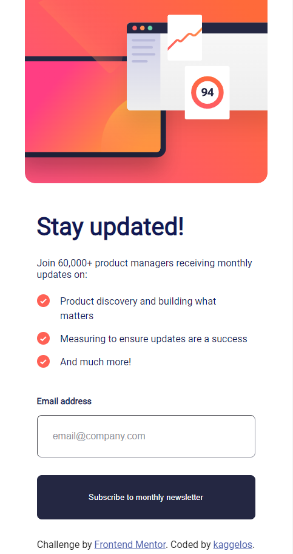

# Frontend Mentor - Newsletter sign-up form with success message solution

This is a solution to the [Newsletter sign-up form with success message challenge on Frontend Mentor](https://www.frontendmentor.io/challenges/newsletter-signup-form-with-success-message-3FC1AZbNrv). Frontend Mentor challenges help you improve your coding skills by building realistic projects. 

## Table of contents

- [Overview](#overview)
  - [Screenshots](#screenshots)
  - [Links](#links)
- [My process](#my-process)
  - [Built with](#built-with)
  - [Useful resources](#useful-resources)
- [Author](#author)

## Overview

### Screenshots

### Links

- Solution URL: [https://www.github.com/kaggelos/newsletter-signup-with-success-message/](https://www.github.com/kaggelos/newsletter-signup-with-success-message/)
- Live Site URL: [https://kaggelos.github.io/newsletter-signup-with-success-message/](https://kaggelos.github.io/newsletter-signup-with-success-message/)

## My process

### Built with

- Flexbox
- Mobile-first workflow
- HTML Forms
- JavaScript

### Useful resources

- [W3Schools.com](https://www.w3schools.com) - Very useful website to remind yourself of different HTML, CSS and JavaScript properties and functions

## Author

- GitHub - [kaggelos](https://www.github.com/kaggelos/)
- Frontend Mentor - [@kaggelos](https://www.frontendmentor.io/profile/kaggelos)
